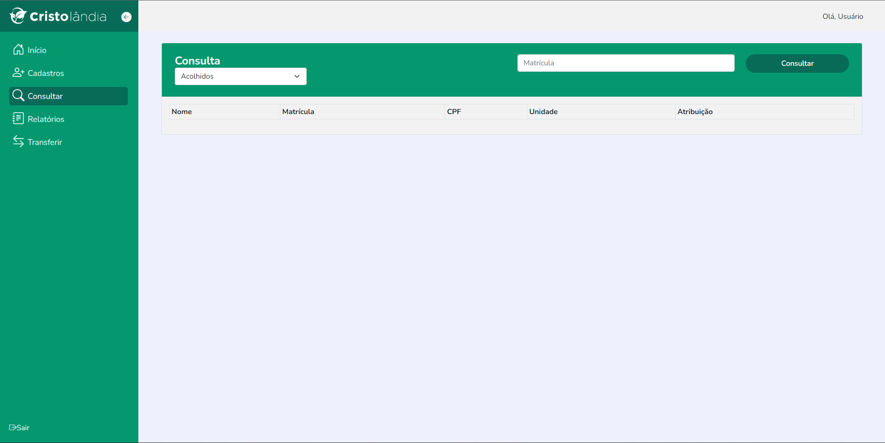
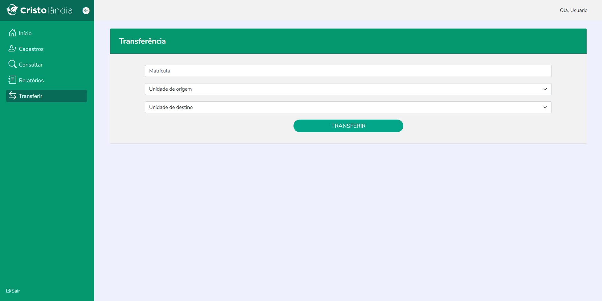

# Cristolândia

### Proposta 📝: 

- Site com sistema de cadastro para uma ONG. 
- Interação com o banco de dados para cadastrar as informações dos acolhidos.
- Resgate e busca de informações do banco de dados.
- Entrega e tratamento dos dados guardados no banco. 

### Tecnologias 🌎: 

- ReactJS.
- Bootstrap.

## Sumário 📒: 

- [Documentação](#documentação-)

- [Telas](#telas-do-sistema-)
    - [Login](#login)
    - [Home](#home)
    - [Consulta](#consulta)
    - [Cadastro](#cadastro)
    - [Relatório](#relatório)
    - [Transferir](#transferir)

## Documentação 📃:


### Instalem as dependências antes de inicializar a aplicação. 
```javascript  
npm install 
``` 
ou 
```javascript  
npm i 
``` 

### Após instalar as dependências, a aplicação ficará disponível http://localhost:3000 ao executar o comando no terminal:
```javascript  
npm start 
``` 

### Telas do Sistema 📺


## Login

### O usuário pode fazer o acesso ao sistema. Caso ele esqueça a sua senha de acesso ele pode recuperá-la. 


## Home

### O usuário consegue verificar as informações principais sobre o status da unidade atual. 


## Cadastro

### Consegue cadastrar um novo acolhido. 


## Consulta

### Consegue consultar e localizar um acolhido. 


## Relatório

### Gera relatórios com informações sobre os acolhidos. 


## Transferir

### Faz a transferência de um acolhido de uma unidade para outra. 



### **[⬆ VOLTAR AO SUMÁRIO](#sumário-)**
